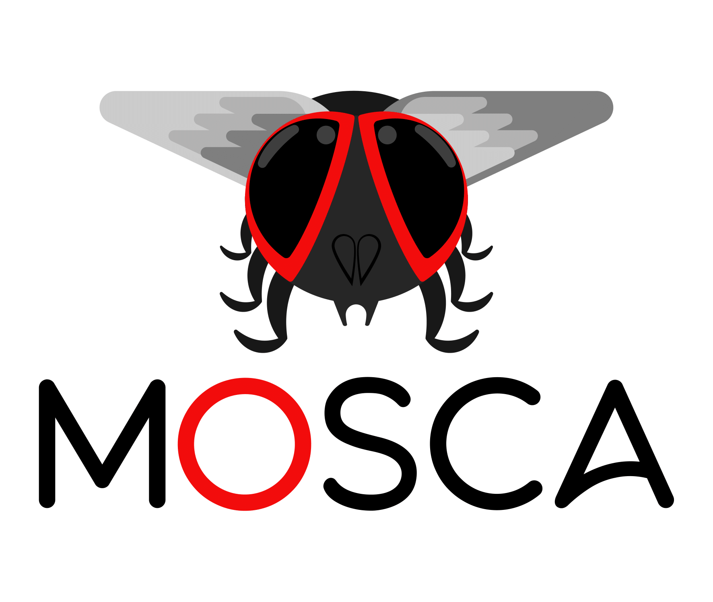

Logo by [Sérgio A. Silva](https://www.ceb.uminho.pt/People/Details/64888072-5cde-42da-b7e5-691d380cefb2)

# Meta-Omics Software for Community Analysis (MOSCA)

**MOSCA** (portuguese for fly) is a pipeline designed for performing metagenomics (MG) and metatranscriptomics (MT) integrated data analyses, in a mostly local and fully automated workflow.

## Features
* **Preprocessing** where low quality regions of data are trimmed and reads less interest are removed. FastQC's reports are used to automatically set the parameters for the other tools. It includes:
    * initial quality check with **FastQC**
    * Illumina artificial sequences removal with **Trimmomatic**: based on **FastQC** reports, MOSCA will find the adapters file most approprita to the data
    * rRNA removal with **SortMeRNA**: uses Pfam and SILVA databases as reference
    * quality trimming with **Trimmomatic**: 
        * another **FastQC** report will be generated after rRNA removal, and will be used to set the parameters for **Trimmomatic**'s hard trimmers (CROP and HEADCROP). This will ensure that the data will be reported as excellent by FastQC
        * reads with less than 20 average quality or 100 nuleotides of length will also be removed
    * final quality check with **FastQC** 
* **Assembly** where MG trimmed reads will be assembled to partially reconstruct the original genomes in the samples. It includes:
    * assembly with two possible assemblers - **MetaSPAdes** and **Megahit** - which will be used in a multi-kmer approach
    * control over the quality of the contigs, with **MetaQUAST** reporting on several classical metrics (such as N50 and L50) and alignment of reads for estimating percentage of reads used in assembly, with **Bowtie2**
* **Annotation** where proteins present in the contigs will be identified. It includes:
    * gene calling with **FragGeneScan**
    * annotation of identified ORFs with **DIAMOND**, using the **UniProt database** as reference - MOSCA only reports on the first annotation
    * retrieval of biological information with **UniProt ID mapping** API
    * functional annotation with [**reCOGnizer**](https://anaconda.org/bioconda/reCOGnizer), using the **COG database** as reference
        * MOSCA automatically **generates new databases by the number of threads specified**, thus allowing for multithread annotation with **RPSBLAST**
    * the quantification of each protein in MG data, by alignment of MG reads to the contigs using **Bowtie2** and quantification of reads to protein using **HTSeq-count**
* **Binning** where the contigs are clustered into taxonomic units, to validate (or not) the annotation, and possibily help reconstructing genomes from the samples
    * **MaxBin2** bins the contigs by tetranucleotide composition, relative abundance, and marker genes analysis
    * the final bins are reported for their completeness - how many of the marker genes are present in each bin
* **Metatranscriptomics analysis** where the expression of each identified gene is quantified. It includes:
    * alignment of MT reads to the MG contigs with **Bowtie2**, and quantification of reads to protein using **HTSeq-count**
    * differential gene expression and multisample comparison using **DESeq2**
* **Normalization** of protein quantification for the final report using **edgeR**
* **Pathway representation** with [**KEGGCharter**](https://anaconda.org/bioconda/KEGGCharter), representing both the metabolic networks of most abundant taxa and expression levels of metabolic functions

## Setting up MOSCA

MOSCA files can be retrieved from git.
```
git clone https://github.com/iquasere/MOSCA.git
```

MOSCA requires Conda previously installed. Instructions on installing Anaconda on an Ubuntu 18.04 may be found [here](https://www.digitalocean.com/community/tutorials/how-to-install-anaconda-on-ubuntu-18-04-quickstart). Alternatively, you can directly download the installation for Ubuntu with which MOSCA was tested - problems have been found using more recent distributions.
```
wget https://repo.anaconda.com/archive/Anaconda3-2019.03-Linux-x86_64.sh
bash Anaconda3-2019.03-Linux-x86_64.sh
```

After having Conda available, the bash script that will install all of its pre-dependencies and databases can be run as follow: 
```
bash MOSCA/install.bash
```

### Installation with Bioconda

To use MOSCA through Bioconda, an environment must be created containing all the dependencies. 
Create the environment and install MOSCA with ```conda create -n mosca -c bioconda -c conda-forge mosca```.
Activate the environment with ```conda activate mosca```.

### MOSCA is also available as a Docker image!

To use MOSCA's Docker version, Docker must first be installed.

```
sudo apt-get update
sudo apt-get install docker-ce docker-ce-cli containerd.io
```

After having docker installed in the system, pull MOSCA's image.

```
docker pull iquasere/mosca:latest
```

## Base arguments for running MOSCA

Since 1.2.0, MOSCA only accepts input from a config file, in either JSON or YAML format.
This repo has an available [config file](https://github.com/iquasere/MOSCA/blob/development/config/config.json), 
which can be used for MOSCA as follows:
```
python mosca.py --configfile config.json
```
